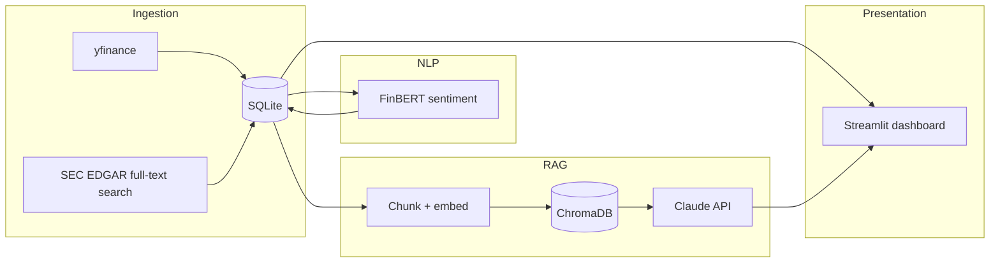

# MarketPulse AI

An LLM-powered research assistant for public-market analysis: it pulls stock price history and SEC filing excerpts, scores them for sentiment, indexes them for retrieval-augmented Q&A with Claude, and surfaces everything in an interactive dashboard.

Built as a portfolio project for AI/Data Science internship applications — it's intentionally scoped like a "prototype quick-win" business tool rather than a research notebook: real (free) data sources, a SQL storage layer, tests, CI, and a documented cloud deployment path.

## What it does

1. **Ingests** stock price history (`yfinance`) and SEC filing excerpts (EDGAR full-text search API) for a ticker.
2. **Scores sentiment** on filing/news text with FinBERT (a finance-specific NLP model), falling back to a lightweight keyword scorer when `transformers`/`torch` aren't installed.
3. **Indexes** filing text into a local vector store (ChromaDB) and answers natural-language questions about it using the Claude API, with source citations — a small retrieval-augmented generation (RAG) pipeline.
4. **Stores** everything in SQLite (swappable for Postgres) for structured querying.
5. **Visualizes** price history, sentiment trends, and filings in a Streamlit dashboard with an embedded Q&A chat box.

## Architecture



## Quickstart

```bash
git clone https://github.com/<your-username>/marketpulse-ai.git
cd marketpulse-ai
python -m venv .venv && source .venv/bin/activate   # Windows: .venv\Scripts\activate
pip install -r requirements.txt
cp .env.example .env   # then fill in ANTHROPIC_API_KEY and SEC_USER_AGENT

python scripts/init_db.py
python scripts/run_pipeline.py --ticker AAPL
streamlit run src/marketpulse/dashboard/app.py
```

Without an `ANTHROPIC_API_KEY`, everything works except the Q&A answer generation step (retrieval and indexing still run; the dashboard shows a clear error for that one feature until a key is added).

### Running tests

```bash
pip install -r requirements-dev.txt
pytest -v
```

All tests are offline and mock external calls (yfinance, SEC EDGAR, ChromaDB, the sentiment model) so they run in seconds with no API keys, no network access, and no GPU — see `tests/`.

## Project layout

```
src/marketpulse/
  config.py           # env-driven settings, sensible defaults
  db.py                # SQLite schema + CRUD (swap db_path for Postgres later)
  ingestion/
    market_data.py     # yfinance price history
    filings.py          # SEC EDGAR full-text search + CIK lookup
  nlp/
    sentiment.py        # FinBERT sentiment, lexicon fallback
  rag/
    pipeline.py          # chunking, ChromaDB indexing/retrieval, Claude Q&A
  dashboard/
    app.py               # Streamlit BI dashboard
scripts/
  init_db.py
  run_pipeline.py        # end-to-end CLI: ingest -> score -> index
tests/                   # offline unit tests for every module above
.github/workflows/ci.yml # lint + test on every push/PR
```

## Cloud deployment

The app is containerized (`Dockerfile`) so any of the three major clouds work; pick whichever matches the job description you're targeting:

- **AWS**: push the image to ECR, run it on App Runner or ECS Fargate; swap SQLite for RDS Postgres and set `MARKETPULSE_DB_PATH` to a Postgres connection string (requires switching `db.py`'s `sqlite3` calls to a Postgres driver — noted as a stretch goal).
- **Azure**: push to Azure Container Registry, deploy to Azure App Service (Web App for Containers); use Azure OpenAI or keep the Anthropic API for the LLM step.
- **GCP**: push to Artifact Registry, deploy to Cloud Run (`gcloud run deploy --source .`); Cloud SQL for Postgres if you outgrow SQLite.

## Why these choices

- **FinBERT over a generic sentiment model** — pretrained on financial text, so "declining margins" scores correctly instead of reading as neutral small talk.
- **RAG over fine-tuning** — grounds answers in the actual filing text with citations, avoids hallucinated numbers, and needs no model training pipeline — the same tradeoff most applied-AI teams make for a document-Q&A feature.
- **SQLite for the storage layer** — zero setup for a portfolio project, but the schema and query functions are plain SQL so moving to Postgres is a driver swap, not a rewrite.
- **Streamlit for the dashboard** — fastest path from "data in SQL" to an interactive BI-style UI a non-technical stakeholder could actually use.

## Roadmap / possible extensions

- Swap SQLite for a hosted Postgres instance (Supabase/RDS free tier).
- Add portfolio-level aggregation across a watchlist instead of one ticker at a time.
- Deploy the Streamlit app publicly (Streamlit Community Cloud) and link a live demo here.
- Add authentication and multi-user support if this ever needs to be shared beyond a personal demo.

## License

MIT — see [LICENSE](LICENSE).
