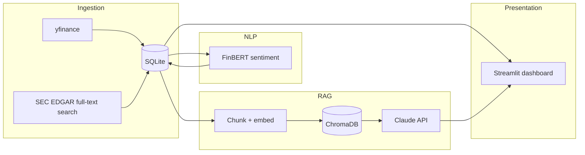

# MarketPulse AI

An LLM-powered research assistant for public-market analysis: it pulls stock price history and SEC filing excerpts, scores them for sentiment, indexes them for retrieval-augmented Q&A with Claude, and surfaces everything in an interactive dashboard.

Built as a portfolio project for AI/Data Science internship applications — it's intentionally scoped like a "prototype quick-win" business tool rather than a research notebook: real (free) data sources, a SQL storage layer, tests, CI, and a documented cloud deployment path.

## What it does

1. **Ingests** stock price history (`yfinance`) and the "Item 1A. Risk Factors" section of each of a company's five most recent 10-Ks (SEC EDGAR) for a ticker.
2. **Scores sentiment** on filing/news text with FinBERT (a finance-specific NLP model), falling back to a lightweight keyword scorer when `transformers`/`torch` aren't installed.
3. **Indexes** filing text into a local vector store (ChromaDB) and answers natural-language questions about it using the Claude API, with source citations — a small retrieval-augmented generation (RAG) pipeline.
4. **Stores** everything in SQLite (swappable for Postgres) for structured querying.
5. **Visualizes** price history, filing-by-filing tone, and filings in a Streamlit dashboard with an embedded Q&A box, scoped to the selected company and rate-limited to keep API costs bounded.

## Architecture


```mermaid
flowchart LR
    subgraph Ingestion
        YF[yfinance] --> DB[(SQLite)]
        EDGAR[SEC EDGAR full-text search] --> DB
    end
    subgraph NLP
        DB --> FinBERT[FinBERT sentiment]
        FinBERT --> DB
    end
    subgraph RAG
        DB --> Chunk[Chunk + embed]
        Chunk --> Chroma[(ChromaDB)]
        Chroma --> Claude[Claude API]
    end
    subgraph Presentation
        DB --> Dash[Streamlit dashboard]
        Claude --> Dash
    end
```

## Quickstart

```bash
git clone https://github.com/<your-username>/marketpulse-ai.git
cd marketpulse-ai
python -m venv .venv && source .venv/bin/activate   # Windows: .venv\Scripts\activate
pip install -r requirements.txt
cp .env.example .env   # then fill in ANTHROPIC_API_KEY and SEC_USER_AGENT

streamlit run src/marketpulse/dashboard/app.py
```

The dashboard works immediately: on startup it loads a bundled snapshot of real data (`demo_data/snapshot.json`) for any ticker the database doesn't have yet. To pull live data instead, use **Refresh** in the sidebar, or the CLI:

```bash
python scripts/run_pipeline.py --ticker AAPL
```

Without an `ANTHROPIC_API_KEY`, everything works except the Q&A answer generation step (retrieval and indexing still run; the dashboard shows a clear error for that one feature until a key is added).

To make the bundled demo data more current, rebuild the snapshot and commit it. It builds in a throwaway database, so your local data is never touched:

```bash
python scripts/build_snapshot.py
```

### Running tests

```bash
pip install -r requirements-dev.txt
pytest -v
```

All tests are offline and mock external calls (yfinance, SEC EDGAR, ChromaDB, the sentiment model) so they run in seconds with no API keys, no network access, and no GPU — see `tests/`.

## Project layout

```
src/marketpulse/
  config.py           # env-driven settings, sensible defaults
  db.py                # SQLite schema + CRUD (swap db_path for Postgres later)
  refresh.py           # ingest -> score -> index for one ticker (shared by CLI, dashboard, snapshot builder)
  snapshot.py          # export/load the bundled demo snapshot
  ingestion/
    market_data.py     # yfinance price history
    filings.py          # SEC EDGAR full-text search + CIK lookup
  nlp/
    sentiment.py        # FinBERT sentiment, lexicon fallback
  rag/
    pipeline.py          # chunking, ChromaDB indexing/retrieval, Claude Q&A
  dashboard/
    app.py               # Streamlit BI dashboard
scripts/
  init_db.py
  run_pipeline.py        # end-to-end CLI: ingest -> score -> index
  build_snapshot.py      # rebuild demo_data/snapshot.json from live data
  reset_data.py          # delete the local SQLite DB + Chroma index
demo_data/snapshot.json  # real data the dashboard loads on a cold start
.streamlit/config.toml   # dashboard theme
tests/                   # offline unit tests for every module above, plus a headless dashboard smoke test
.github/workflows/ci.yml # lint + test on every push/PR
```

## Cloud deployment

The app is containerized (`Dockerfile`) so any of the three major clouds work; pick whichever matches the job description you're targeting:

- **AWS**: push the image to ECR, run it on App Runner or ECS Fargate; swap SQLite for RDS Postgres and set `MARKETPULSE_DB_PATH` to a Postgres connection string (requires switching `db.py`'s `sqlite3` calls to a Postgres driver — noted as a stretch goal).
- **Azure**: push to Azure Container Registry, deploy to Azure App Service (Web App for Containers); use Azure OpenAI or keep the Anthropic API for the LLM step.
- **GCP**: push to Artifact Registry, deploy to Cloud Run (`gcloud run deploy --source .`); Cloud SQL for Postgres if you outgrow SQLite.

## Why these choices

- **FinBERT over a generic sentiment model** — pretrained on financial text, so "declining margins" scores correctly instead of reading as neutral small talk.
- **RAG over fine-tuning** — grounds answers in the actual filing text with citations, avoids hallucinated numbers, and needs no model training pipeline — the same tradeoff most applied-AI teams make for a document-Q&A feature.
- **SQLite for the storage layer** — zero setup for a portfolio project, but the schema and query functions are plain SQL so moving to Postgres is a driver swap, not a rewrite.
- **Streamlit for the dashboard** — fastest path from "data in SQL" to an interactive BI-style UI a non-technical stakeholder could actually use.

## Roadmap / possible extensions

- Swap SQLite for a hosted Postgres instance (Supabase/RDS free tier).
- Add portfolio-level aggregation across a watchlist instead of one ticker at a time.
- Install the optional FinBERT extra in the deployed app; the lexicon fallback is a blunt instrument on risk-factor prose.
- Add authentication and multi-user support if this ever needs to be shared beyond a personal demo.

## Live demo

**[Live dashboard →](https://marketpulse-ai-yunzhu.streamlit.app/)** (hosted free on Streamlit Community Cloud, deployed straight from this repo)

Streamlit Community Cloud puts idle apps to sleep, and the first visitor after that sees a "wake up" screen for a minute or so while the container restarts. A restart also wipes the app's SQLite database. To make sure there is always something to see, the app loads `demo_data/snapshot.json` (real prices and 10-K data, captured by `scripts/build_snapshot.py`) into the empty database on startup. The page is populated immediately, with a banner showing the snapshot's date. **Refresh** in the sidebar pulls live data for a ticker.

### Cost and abuse guardrails

Only the Q&A box calls the paid Anthropic API; charts, ingestion, and sentiment are free. A public link means anyone (or any bot) can click it, so:

- **Q&A is capped** at 5 questions per visitor session and 30 per day across all visitors. The caps are checked *before* any API call, and both can be changed via `MARKETPULSE_MAX_SESSION_QUESTIONS` / `MARKETPULSE_MAX_DAILY_QUESTIONS`.
- **Live refresh has a 10-minute cooldown per ticker**, shared by all visitors, so nobody can hammer SEC EDGAR under this app's User-Agent.
- **Set a spend limit in the Anthropic Console** (Settings → Workspaces → your workspace → Spend limits) as the hard backstop. The in-app daily counter lives in the same SQLite file and resets whenever the app restarts.

## License

MIT — see [LICENSE](LICENSE).
